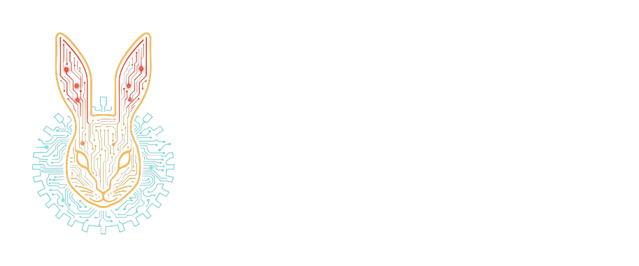

# kotlin-parsing-charinput



<p align=center>
    
    
</p>

`kotlin-parsing-charinput` is a Kotlin Multiplatform library for cursor-based character input in
parsers.

It provides lookahead, mark/reset, source positions, span capture, in-memory inputs, JVM/Android
reader and file inputs, and small default parsers for common token shapes such as identifiers,
quoted strings, whitespace, and decimal numbers.

## Why Use It

Parser code often needs the same low-level operations:

- inspect the current character without consuming it
- look ahead before choosing a parse branch
- mark a position and rewind if a branch fails
- capture the consumed source as text, positions, or both
- keep line, column, and absolute index information for diagnostics

`kotlin-parsing-charinput` keeps those concerns in one small API so higher-level parsers can focus
on grammar rules instead of cursor bookkeeping.

## 🚀 Installation

```kotlin
repositories {
    mavenCentral()
}

dependencies {
    implementation("one.wabbit:kotlin-parsing-charinput:1.2.0")
}
```

## 🚀 Usage

```kotlin
import one.wabbit.parsing.CharInput
import one.wabbit.parsing.DefaultParsers
import one.wabbit.parsing.StringStyle

val input = CharInput.withTextAndPosSpans("name = \"wabbit\"\n")

val key = DefaultParsers.readIdentifier(input)
DefaultParsers.skipHorizontalSpace(input)
check(input.takeExact("="))
DefaultParsers.skipHorizontalSpace(input)
val value = DefaultParsers.readString(input, StringStyle.Json)

check(key.value == "name")
check(value.value == "wabbit")
check(key.span.raw == "name")
check(key.span.start.line == 1L)
```

The parser functions advance the input as they succeed. The `TextAndPosSpan` factory captures both
the raw source text and the absolute start/end positions for every parsed token.

## Span Choices

The companion factories choose how much capture data each span carries:

- `CharInput.withEmptySpans(input)` captures no text or position data.
- `CharInput.withPosOnlySpans(input)` captures start and end positions.
- `CharInput.withTextOnlySpans(input)` captures raw source text.
- `CharInput.withTextAndPosSpans(input)` captures raw source text plus start and end positions.

For custom span types, implement `SpanFactory` or `SpanLike`.

## Input Implementations

In-memory input is available on every supported target:

```kotlin
val input = CharInput.withTextOnlySpans("alpha beta")
```

JVM and Android also provide reader/file-backed inputs:

```kotlin
import java.io.StringReader
import one.wabbit.parsing.CharInput
import one.wabbit.parsing.TextOnlySpan

val input = CharInput.streaming(StringReader("alpha beta"), TextOnlySpan.spanLike)
```

The `ring`, `streaming`, and `seekable` factories are JVM/Android APIs. On native targets they throw
`UnsupportedOperationException`.

## End Of Input

`CharInput.current` and `CharInput.peek` return `CharInput.EOB` at end of input. This is a sentinel,
not source text. Parser loops should check it before treating the current value as a real character.

## Status

This library is intended as a reusable low-level parser input layer. The core `CharInput` API and
the built-in span shapes are stable. The default token parsers are small convenience helpers rather
than a full parser-combinator framework.

## Documentation

- [User guide](docs/user-guide.md)
- [API reference notes](docs/api-reference.md)
- [Troubleshooting](docs/troubleshooting.md)
- [Development](docs/development.md)

Generated API docs can be built locally with Dokka. See [API reference notes](docs/api-reference.md)
for the command.

## Release Notes

- [CHANGELOG.md](CHANGELOG.md)

## Licensing

This project is licensed under the GNU Affero General Public License v3.0 (AGPL-3.0) for open
source use.

For commercial use, contact Wabbit Consulting Corporation at `wabbit@wabbit.one`.

## Contributing

Before contributions can be merged, contributors need to agree to the repository CLA.
